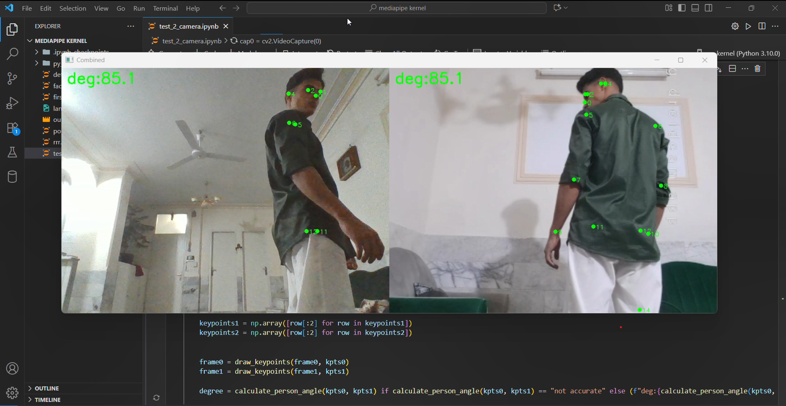
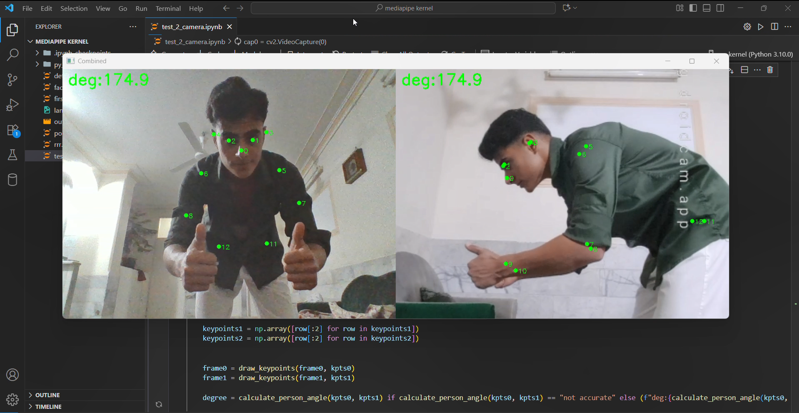
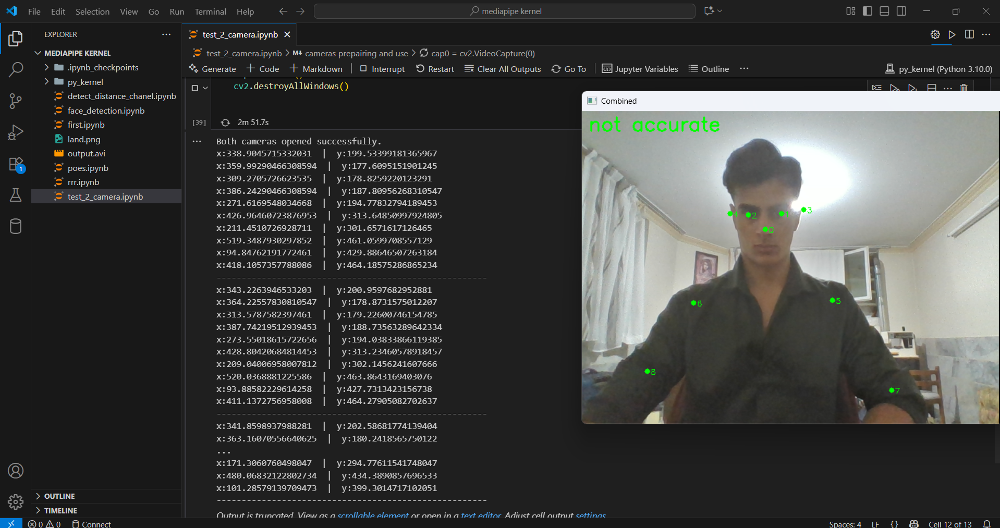

# Pose Angle Estimation with Dual Cameras

This project demonstrates a **computer vision system** that captures two video streams at a 90-degree angle (using a **laptop webcam** and a **phone camera via DroidCam**) to estimate a person's **standing angle** in 3D space. The system leverages **MoveNet (Thunder version)** for pose detection and applies a custom algorithm to compute the facing angle of the person.

---

## 📹 Project Overview
- **Two Cameras**: One laptop webcam + one smartphone camera (via DroidCam), placed at a 90° angle.
- **Pose Detection**: MoveNet Thunder extracts human keypoints from both camera views.
- **Angle Prediction**: A Python algorithm computes the standing orientation of the person based on nose and shoulder positions from both views.

---

## ⚙️ How It Works
1. Capture video streams from two cameras.
2. Apply MoveNet Thunder to extract keypoints from each frame.
3. Use the **nose and shoulder keypoints** from both cameras.
4. Apply vector mathematics to calculate the **facing direction and angle**.

---

## 🧮 Angle Prediction Algorithm
The core algorithm computes the facing angle of the person using pose keypoints:

```python
NOSE = 0
LEFT_SHOULDER = 5
RIGHT_SHOULDER = 6

def calculate_person_angle(keypoints_cam1, keypoints_cam2, confidence_threshold=0.3):
try:
    required_indices = [NOSE, LEFT_SHOULDER, RIGHT_SHOULDER]
    max_index = max(required_indices)
    if (keypoints_cam1 is None or len(keypoints_cam1) <= max_index or
        keypoints_cam2 is None or len(keypoints_cam2) <= max_index):
        print("Error: Keypoint list is None, missing, or too short. A camera may have failed to detect a pose.")
        return None

    # Get keypoints from Cameras
    ls1 = keypoints_cam1[LEFT_SHOULDER]
    rs1 = keypoints_cam1[RIGHT_SHOULDER]
    nose1 = keypoints_cam1[NOSE]

    ls2 = keypoints_cam2[LEFT_SHOULDER]
    rs2 = keypoints_cam2[RIGHT_SHOULDER]
    nose2 = keypoints_cam2[NOSE]

    # Check confidence scores
    if not all(kp['score'] > confidence_threshold for kp in [ls1, rs1, nose1, ls2, rs2, nose2]):
        return "not accurate"

    # Extract x-coordinates
    x_l1, x_r1, x_n1 = ls1['x'], rs1['x'], nose1['x']
    x_l2, x_r2, x_n2 = ls2['x'], rs2['x'], nose2['x']

    dx = x_l1 - x_r1
    dz = x_l2 - x_r2

    mid_shoulder_x = (x_l1 + x_r1) / 2
    mid_shoulder_z = (x_l2 + x_r2) / 2

    nose_dir_vec_x = x_n1 - mid_shoulder_x
    nose_dir_vec_z = x_n2 - mid_shoulder_z

    p1_x, p1_z = -dz, dx
    dot_product = (p1_x * nose_dir_vec_x) + (p1_z * nose_dir_vec_z)

    if dot_product > 0:
        facing_vec_x, facing_vec_z = p1_x, p1_z
    else:
        facing_vec_x, facing_vec_z = dz, -dx

    angle_rad = math.atan2(facing_vec_x, facing_vec_z)
    angle_deg = math.degrees(angle_rad)

    return angle_deg
```

---
## 🧑‍💻 Test presictions
<p>
    
    
    
</p>

---

## 🚀 Features
- Dual camera setup for improved 3D understanding.
- MoveNet Thunder for **real-time pose detection**.
- Angle estimation based on **vector projection**.
- Handles missing keypoints and low-confidence detections.

---

## 🛠️ Requirements
- Python 3.8+
- Tensorflow hub (for import MoveNet)
- OpenCV
- MoveNet Thunder model
- DroidCam (for phone camera)

Install dependencies:
```bash
pip install numpy tensorflow-hub opencv-python
```

---

## 📊 Applications
- Ergonomic assessment 🧍‍♂️
- Sports performance analysis ⚽
- Gesture recognition ✌️
- Human-computer interaction 💻

---

## 📌 Future Improvements
- Extend to full **3D pose reconstruction**.
- Optimize inference speed with **TensorRT** or **ONNX**.
- Add GUI for visualization.

---

## 📷 Example Setup
```
Laptop Webcam (Front)  ────────▶  Person  ◀───────  Phone Camera (Side)
```

---

## 🤝 Contributing
Pull requests are welcome! For major changes, please open an issue first to discuss what you would like to change.

---

## 📜 License
This project is licensed under the MIT License.
